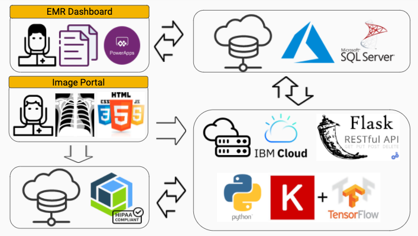

# ChestX.ai

## Berkeley Capstone Project (Summer 2020)
### Curtis Lin, Chloe Wu, Justin Wu, Douglas Xu

-----

## Platform Architecture

### 1. Packages:
- Python 3.8.2
- Numpy 1.19.1 and 1.16.4
- Matplotlib 3.3.0
- OpenCV 4.3.0
- Flask 1.1.2
- Flask-Bootstrap 3.3.7.1.dev1
- pyodbc 4.0.30
- Tensorflow 2.2.0
- Keras 2.3.0-tf

### 2. IBM cloud server setup
- Please read `Server_setup.md`

### 3. ChestX.ai back-end
- ChestX.ai back-end files are in the folder `ChestXai_backend`
- ChestX.ai back-end was setup on IBM Cloud virtual server.
- The IBM Cloud Object Storage was mounted to virtual server for images and prediciton results storage. 
- `App.py` retrieves chest X-ray prediction for front-end image upload portal, performs disease predictions, generates Grad-CAM heatmap, and updates the results to MS SQL server, 
- The `image upload portal` was built with HTML/CSS/JS and the files are in `templetes` and `static` folder.
- The 3 tier Tensorflow models are in `xray` folder.

### 4. ChestX.ai MS SQL server
- The files are in `SQL_Scripts`

### 5. Modeling 
- 

### 6. ChestX.ai Project Website
- The files are in `ChestXai_Project_Wbsite`

